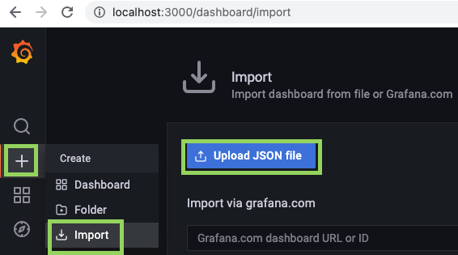

### 2023/11/28

For a sample Digital Twin application highlighting an AI-assistant integration, check out our blog: [Building an AI Assistant for Smart Manufacturing with AWS IoT TwinMaker and Amazon Bedrock](https://aws.amazon.com/blogs/iot/building-an-ai-assistant-for-smart-manufacturing-with-aws-iot-twinmaker-and-amazon-bedrock/)

For a sample Digital Twin application built with a React application on [iot-app-kit](https://github.com/awslabs/iot-app-kit) check out [CookieFactoryV2](https://github.com/aws-samples/aws-iot-twinmaker-samples/tree/main/src/workspaces/cookiefactoryv2)

For a sample Digital Twin application highlighting [TwinMaker Knowledge Graph](https://aws.amazon.com/about-aws/whats-new/2022/11/twinmaker-knowledge-graph-generally-available-aws-iot-twinmaker/), check out our guided [SmartBuilding workshop](https://catalog.us-east-1.prod.workshops.aws/workshops/93076d98-bdf1-48b8-bfe8-f4039ca1bf25/en-US)!

---

Note: if you are just looking for sample IAM policies to use when creating an AWS IoT TwinMaker workspace, please see these sample [permission](./docs/sample_workspace_role_permission_policy.json) and [trust relationship](./docs/sample_workspace_role_trust_policy.json) policies. If you would like to create this role [using AWS CloudFormation](https://console.aws.amazon.com/cloudformation/home#/stacks/create/template), please use [this template](./docs/sample_workspace_role.yml) .

The role permission policy will only grant AWS IoT TwinMaker access to manage workspace resources in your S3 buckets. We recommend you scope down the bucket permissions to your specific S3 bucket once it is created. You will also need to update the role to grant further permissions for your use-case, such as invoking AWS IoT TwinMaker custom AWS Lambda connectors you've implemented or accessing video stream metadata in AWS IoT SiteWise and Amazon Kinesis Video Streams. For an end-to-end setup experience (including auto-generation of these roles with all necessary permissions for the sample use-case) we recommend following the getting started guide below.

# AWS IoT TwinMaker Getting Started

## Summary

This project walks you through the process of building a digital twin application using AWS IoT TwinMaker. The project contains many samples, including a simulated cookie factory that you can use to explore many of the features of IoT TwinMaker. After going through this README you will have the following dashboard running in Grafana, which you can use to interact with the sample CookieFactory digital twin.


If you run into any issues, please see the Troubleshooting section of this page.

## Prerequisites

Note: These instructions have primarily been tested for Mac/Linux/WSL environments. For a standardized development environment, consider following our [Cloud9 setup guide](./CLOUD9_SETUP.md) instead.

1. This sample depends on AWS services that might not yet be available in all regions. Please run this sample in one of the following regions:
   - US East (N. Virginia) (us-east-1)
   - US West (Oregon) (us-west-2)
   - Europe (Ireland) (eu-west-1)
2. An AWS account for IoT TwinMaker + [AWS CLI](https://docs.aws.amazon.com/cli/latest/userguide/install-cliv2.html)
   - We recommend that you [configure](https://docs.aws.amazon.com/cli/latest/userguide/cli-chap-configure.html) your default credentials to match the account in which you want to set up this getting started example. Use the following command to verify that you are using the correct account. (This should be pre-configured in Cloud9.)
     ```bash
     aws sts get-caller-identity
     ```
   - Ensure your AWS CLI version is at least 1.22.94. (or 2.5.5+ for AWS CLI v2)
     ```bash
     aws --version
     ```
   - When you are set up, test your access with the following command. (You should not receive errors.)
     ```
      aws iottwinmaker list-workspaces --region us-east-1
     ```
3. [Python3](https://www.python.org/downloads/)
   - Verify your python3 path and version (3.7+). (This should be pre-installed in Cloud9.)
     ```
     python3 --version
     ```
   - **Optional**: [Pyenv](https://github.com/pyenv/pyenv) and [Pyenv-virtualenv](https://github.com/pyenv/pyenv-virtualenv). Use `pyenv` and `pyenv-virtualenv` to ensure that you have correct Python dependencies. They are optional as long as you have a system-wide Python3 installation, but highly recommended for avoiding conflicts between multiple python projects.
4. [Node.js & NPM](https://nodejs.org/en/) with node v14.18.1+ and npm version 8.10.0+. (This should be pre-installed in Cloud9.) Use the following commands to verify.

   ```
   node --version
   ```

   ```
   npm --version
   ```

5. [AWS CDK toolkit](https://docs.aws.amazon.com/cdk/latest/guide/getting_started.html#getting_started_install) with version at least `2.27.0`. (The CDK should be pre-installed in Cloud9, but you may need to bootstrap your account.) Use the following command to verify.

   ```
   cdk --version
   ```

   - You will also need to bootstrap your account for CDK so that custom assets, such as sample Lambda functions, can be easily deployed. Use the following command.

     ```
     cdk bootstrap aws://[your 12 digit AWS account id]/[region]

     # example
     # cdk bootstrap aws://123456789012/us-east-1
     ```

6. [Docker](https://docs.docker.com/get-docker/) version 20+. (This should be pre-installed in Cloud9.) Authenticate Docker for public ECR registries
   ```
   docker --version
   ```
   - Use the following command to build Lambda layers for CDK.
     ```bash
     aws ecr-public get-login-password --region us-east-1 | docker login --username AWS --password-stdin public.ecr.aws
     ```

## Deploying the Sample Cookie Factory Workspace

1. Set up environment variables.

   Set the following environment variables to make it easier to execute the remaining steps.

   ```bash
   # Change into the same directory as this README
   cd [directory_of_this_README]
   ```

   ```bash
   # Set your aws account id, you can use `aws sts get-caller-identity` to see the account id you're currently using
   export CDK_DEFAULT_ACCOUNT=[replace_with_your_aws_account_id]
   ```

   ```bash
   # Set some options for our install. If you want to use another workspace ID then change 'CookieFactory' to your preference
   export GETTING_STARTED_DIR=$PWD
   export AWS_DEFAULT_REGION=us-east-1
   export CDK_DEFAULT_REGION=$AWS_DEFAULT_REGION
   export TIMESTREAM_TELEMETRY_STACK_NAME=CookieFactoryTelemetry
   export WORKSPACE_ID=CookieFactory
   ```

2. Install Python Libraries.

   We use Python to help deploy our Cookie Factory sample data. Use the following command to install the required Python libraries.

   ```bash
   pip3 install -r $GETTING_STARTED_DIR/src/workspaces/cookiefactory/requirements.txt
   ```

3. Create an IoT TwinMaker workspace.

   a. Create an IoT TwinMaker execution role

   Different Digital Twin applications use different resources. Run the following command to create an execution role for our workspace that has the necessary permissions for this sample application. Note that you will use the role name when creating a workspace in the next step.

   ```bash
   python3 $GETTING_STARTED_DIR/src/workspaces/cookiefactory/setup_cloud_resources/create_iottwinmaker_workspace_role.py --region $AWS_DEFAULT_REGION
   ```

   b. Create the workspace in the AWS Console

   Now go to the console and create a workspace with the same name that you used for WORKSPACE_ID in step 1. You can have the console automatically create S3 buckets for you. When asked to provide a role for the workspace, use the role name generated by the preceding script. (The name should contain the string "IoTTwinMakerWorkspaceRole".)

   After entering the workspace settings you will be asked to specify the Grafana environment you will be using to interact with your workspace. We recommend you use Amazon Managed Grafana to host your infrastructure, but you can follow [Grafana instructions](./docs/grafana_local_docker_setup.md) to make your decision and build the environment.

   When asked for your dashboard role, you can follow the instructions in the console to manually create an IAM policy and role to be used in Grafana. You can automatically create the role using the script in this package in the next step after creating the workspace.

   Finally, click "Create" on the Review page to create your workspace.

   Console link for us-east-1: https://us-east-1.console.aws.amazon.com/iottwinmaker/home?region=us-east-1

   c. Create a Grafana dashboard IAM role

   If you did not complete the dashboard setting steps, run the following script to create a role for accessing the workspace on a Grafana dashboard. This uses scoped-down permissions for ReadOnly access to IoT TwinMaker and other AWS services in Grafana. Note the ARN of the role you create. You will use it when configuring a data source in Grafana.

   ```bash
   python3 $GETTING_STARTED_DIR/src/modules/grafana/create_grafana_dashboard_role.py --workspace-id $WORKSPACE_ID --region $AWS_DEFAULT_REGION --account-id $CDK_DEFAULT_ACCOUNT
   ```

   If you are using Amazon Managed Grafana, add the field:

   ```bash
   --auth-provider <Amazon Managed Grafana Workspace IAM Role ARN>
   ```

   Make sure that your current AWS credentials are the same as the ones you use in Grafana. If not, go to the IAM console after running this script and update the trust permissions for the authentication provider you will be using. Read more about your [authentication provider in the documentation](https://docs.aws.amazon.com/iot-twinmaker/latest/guide/dashboard-IAM-role.html#grafana-IAM-role).

   We automatically add permission for IoT TwinMaker and Kinesis Video Streams to enable the basic functionality of the Grafana datasource, Scene Viewer panel, and Video Player panel. If you would like to enable more features of the Video Player (time scrubber bar + video upload request from cache) then you need to manually update your IAM policy by following our [video player policy documentation](https://docs.aws.amazon.com/iot-twinmaker/latest/guide/tm-video-policy.html).

4. Deploy an Instance of the Timestream Telemetry module.

   Timestream Telemetry is a sample telemetry store for IoT data. It uses a single AWS Timestream database and table, and a Lambda function for reading and writing. Later steps will fill this table with sample data for the Cookie Factory. The following commands create the database and table and deploy the lambda function found under /src/lib/timestream_telemetry.

   ```bash
   cd $GETTING_STARTED_DIR/src/modules/timestream_telemetry/cdk/
   ```

   Use the following command to install dependencies for the module

   ```
   npm install
   ```

   Deploy the module. (Enter 'y' when prompted to accept IAM changes.)

   ```
   cdk deploy
   ```

5. Use the following commands to import the Cookie Factory content.

   ```bash
   cd $GETTING_STARTED_DIR/src/workspaces/cookiefactory/

   # import cookie factory data into your workspace
   python3 -m setup_content \
     --telemetry-stack-name $TIMESTREAM_TELEMETRY_STACK_NAME \
     --workspace-id $WORKSPACE_ID \
     --region-name $AWS_DEFAULT_REGION \
     --import-all
   ```

   If you want to reimport the sample content you need to add flags to delete the old content (such as --delete-all or individual flags such as --delete-telemetry and --delete-entities).

   If you want to import only parts of the sample content, you can use individual import flags instead of --import-all (such as --import-telemetry and --import-entities).

   Note: on initial import the script will save the starting timestamp used for generating sample telemetry and video. This is stored in the TwinMaker workspace in the `samples_content_start_time` Tag. On subsequent re-runs of the scripts, this starting timestamp will be re-used for consistent data generation. If you would like to recreate the data using the current time instead, please delete the Tag from the workspace.

6. (Optional) Verify connectivity for entities, scenes, and Unified Data Query (UDQ) Test data by using UDQ.

   After importing all content, you can go to the IoT TwinMaker console to view the entities and scenes that you created.

   - https://us-east-1.console.aws.amazon.com/iottwinmaker/home?region=us-east-1

   AWS IoT TwinMaker provides features to connect to and query your data sources via its component model and Unified Data Query interface. In this getting started, we imported some data into Timestream and set up the component and support UDQ Lambda function that enables us to query it. Use the following command to test whether we're able to query for alarm data by using the `get-property-value-history` API.

   ```
   aws iottwinmaker get-property-value-history \
      --region $AWS_DEFAULT_REGION \
      --cli-input-json '{"componentName": "AlarmComponent","endTime": "2023-06-01T00:00:00Z","entityId": "Mixer_2_06ac63c4-d68d-4723-891a-8e758f8456ef","orderByTime": "ASCENDING","selectedProperties": ["alarm_status"],"startTime": "2022-06-01T00:00:00Z","workspaceId": "'${WORKSPACE_ID}'"}'
   ```

   See [Additional UDQ Sample Requests](#additional-udq-sample-requests) for other supported request examples.

7. Set up Grafana for the Cookie Factory.

   AWS IoT TwinMaker provides a Grafana plugin that you can use to build dashboards using IoT TwinMaker scenes and modeled data sources. Grafana is deployable as a docker container. We recommend that new users follow these instructions to set up Grafana as a local container: [Instructions](./docs/grafana_local_docker_setup.md). (If the link doesn't work in Cloud9, open `docs/grafana_local_docker_setup.md`.)

   For advanced users aiming to set up a production Grafana installation in their account, we recommend checking out https://github.com/aws-samples/aws-cdk-grafana.

8. Import Grafana dashboards for the Cookie Factory.

   When you have the Grafana page open, you can click through the following to import the sample dashboard json file in `$GETTING_STARTED_DIR/src/workspaces/cookiefactory/sample_dashboards/`. (If you are running from Cloud9, you can right-click and download the file locally then import it from your local machine)

   - mixer_alarms_dashboard.json

   

   For the CookieFactory sample running with local Grafana, you can navigate to http://localhost:3000/d/y1FGfj57z/aws-iot-twinmaker-mixer-alarm-dashboard?orgId=1& to see the dashboard.

## Deploying Additional (Add-on) Content

### SiteWise Connector

In this section we'll add SiteWise assets and telemetry, and then update the CookieFactory digital twin entities to link to this data source.

1. Add SiteWise assets and telemetry.

   ```
   python3 $GETTING_STARTED_DIR/src/modules/sitewise/deploy-utils/SiteWiseTelemetry.py import --csv-file $GETTING_STARTED_DIR/src/workspaces/cookiefactory/sample_data/telemetry/telemetry.csv \
     --entity-include-pattern WaterTank \
     --asset-model-name-prefix $WORKSPACE_ID
   ```

2. Update entities to attach SiteWise connector.

   ```
   python3 $GETTING_STARTED_DIR/src/modules/sitewise/lib/patch_sitewise_content.py --workspace-id $WORKSPACE_ID --region $AWS_DEFAULT_REGION
   ```

3. Test SiteWise data connectivity with UDQ to query WaterTank volume metrics.

   ```
   aws iottwinmaker get-property-value-history \
     --region $AWS_DEFAULT_REGION \
     --cli-input-json '{"componentName": "WaterTankVolume","endTime": "2023-06-01T00:00:00Z","entityId": "WaterTank_ab5e8bc0-5c8f-44d8-b0a9-bef9c8d2cfab","orderByTime": "ASCENDING","selectedProperties": ["tankVolume1"],"startTime": "2022-06-01T00:00:00Z","workspaceId": "'${WORKSPACE_ID}'"}'
   ```

### S3 Document Connector

In this section we'll add an S3 connector to allow IoT TwinMaker entities to link to data stored in S3.

Go to the `s3` modules directory and check the [README](./src/modules/s3/README.md).

```
cd $GETTING_STARTED_DIR/src/modules/s3
```

### AWS IoT TwinMaker Insights and Simulation

Note: this add-on will create running Amazon Kinesis Data Analytics (KDA) compute resources that may incur AWS charges. We recommend stopping or deleting the KDA notebook resources with the steps in [Add-on Teardown: AWS IoT TwinMaker Insights and Simulation](#add-on-teardown-aws-iot-twinmaker-insights-and-simulation) once you are finished using them.

In this section we'll use the AWS IoT TwinMaker Flink library to connect our Mixers' telemetry data to two services to enrich our entity data for deeper insights:

* A Maplesoft simulation to calculate Mixer power consumption based on RPM
* A pre-trained machine learning model for RPM anomaly detection

Both services will be exposed as SageMaker endpoints that this Add-on will setup in your account.

Go to the `insights` modules directory and check the [README](./src/modules/insights/README.md).

```
cd $GETTING_STARTED_DIR/src/modules/insights
```

### Additional UDQ Sample Requests

This section contains additional sample requests supported by `get-property-value-history` in the CookieFactory workspace.

1. Single-entity, multi-property request (mixer data)
   
   ```
   aws iottwinmaker get-property-value-history \
      --region $AWS_DEFAULT_REGION \
      --cli-input-json '{"componentName": "MixerComponent","endTime": "2023-06-01T00:00:00Z","entityId": "Mixer_2_06ac63c4-d68d-4723-891a-8e758f8456ef","orderByTime": "ASCENDING","selectedProperties": ["Temperature", "RPM"],"startTime": "2022-06-01T00:00:00Z","workspaceId": "'${WORKSPACE_ID}'"}'
   ```

2. Multi-entity, single-property request (alarm data)

   ```
   aws iottwinmaker get-property-value-history \
     --region $AWS_DEFAULT_REGION \
     --cli-input-json '{"componentTypeId": "com.example.cookiefactory.alarm","endTime": "2023-06-01T00:00:00Z","orderByTime": "ASCENDING","selectedProperties": ["alarm_status"],"startTime": "2022-06-01T00:00:00Z","workspaceId": "'${WORKSPACE_ID}'"}'
   ```
 
3. Multi-entity, multi-property request (mixer data)

   ```
   aws iottwinmaker get-property-value-history \
     --region $AWS_DEFAULT_REGION \
     --cli-input-json '{"componentTypeId": "com.example.cookiefactory.mixer","endTime": "2023-06-01T00:00:00Z","orderByTime": "ASCENDING","selectedProperties": ["Temperature", "RPM"],"startTime": "2022-06-01T00:00:00Z","workspaceId": "'${WORKSPACE_ID}'"}'
   ```

---

## Teardown

**Note that these are destructive actions and will remove all content you have created/modified from this sample.**

You should have the following environment variables set from the previous Setup instructions.

```bash
GETTING_STARTED_DIR=__see_above__
WORKSPACE_ID=__see_above__
TIMESTREAM_TELEMETRY_STACK_NAME=__see_above__
AWS_DEFAULT_REGION=us-east-1
```

### Add-on Teardown: SiteWise Connector

Run the following if you installed the add-on SiteWise content and would like to remove it

```
python3 $GETTING_STARTED_DIR/src/modules/sitewise/deploy-utils/SiteWiseTelemetry.py cleanup --asset-model-name-prefix $WORKSPACE_ID
```

### Add-on Teardown: S3 Document Connector

Run the following if you installed the add-on SiteWise content and would like to remove it

```
aws cloudformation delete-stack --stack-name IoTTwinMakerCookieFactoryS3 --region $AWS_DEFAULT_REGION && aws cloudformation wait stack-delete-complete --stack-name IoTTwinMakerCookieFactoryS3 --region $AWS_DEFAULT_REGION
```

### Add-on Teardown: AWS IoT TwinMaker Insights and Simulation

Run the following if you installed the add-on AWS IoT TwinMaker Insights and Simulation content and would like to remove it. These stacks may take several minutes to delete.

Delete installed assets

```
python3 $INSIGHT_DIR/install_insights_module.py --workspace-id $WORKSPACE_ID --region-name $AWS_DEFAULT_REGION --kda-stack-name $KDA_STACK_NAME --sagemaker-stack-name $SAGEMAKER_STACK_NAME --delete-all
```

Delete cloudformation stacks

```
aws cloudformation delete-stack --stack-name $KDA_STACK_NAME --region $AWS_DEFAULT_REGION && aws cloudformation wait stack-delete-complete --stack-name $KDA_STACK_NAME --region $AWS_DEFAULT_REGION
```

```
aws cloudformation delete-stack --stack-name $SAGEMAKER_STACK_NAME --region $AWS_DEFAULT_REGION && aws cloudformation wait stack-delete-complete --stack-name $SAGEMAKER_STACK_NAME --region $AWS_DEFAULT_REGION
```

### Delete Base Content

Change directory

```
cd $GETTING_STARTED_DIR/src/workspaces/cookiefactory
```

Delete grafana dashboard role (if exists)

```
python3 $GETTING_STARTED_DIR/src/modules/grafana/cleanup_grafana_dashboard_role.py --workspace-id $WORKSPACE_ID --region $AWS_DEFAULT_REGION
```

Delete AWS IoT TwinMaker workspace + contents

```
# this script is safe to terminate and restart if entities seem stuck in deletion
python3 -m setup_content \
     --telemetry-stack-name $TIMESTREAM_TELEMETRY_STACK_NAME \
     --workspace-id $WORKSPACE_ID \
     --region-name $AWS_DEFAULT_REGION \
     --delete-all \
     --delete-workspace-role-and-bucket
```

Delete the Telemetry CFN stack + wait

```
aws cloudformation delete-stack --stack-name $TIMESTREAM_TELEMETRY_STACK_NAME --region $AWS_DEFAULT_REGION && aws cloudformation wait stack-delete-complete --stack-name $TIMESTREAM_TELEMETRY_STACK_NAME --region $AWS_DEFAULT_REGION
```

### (Optional) Delete local Grafana configuration

```
rm -rf ~/local_grafana_data/
```

---

## Troubleshooting

For any issue not addressed here, please open an issue or contact AWS Support.

### `ImportError: libGL.so.1: cannot open shared object file: No such file or directory`

Ensure you have `mesa-libGL` installed. e.g.

```
sudo yum install mesa-libGL
```

---

## Security

See [CONTRIBUTING](CONTRIBUTING.md#security-issue-notifications) for more information.

## License

This project is licensed under the Apache-2.0 License.
