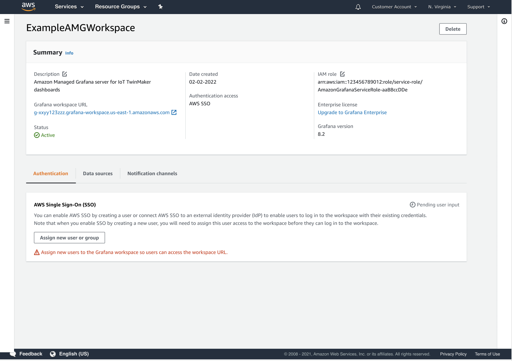
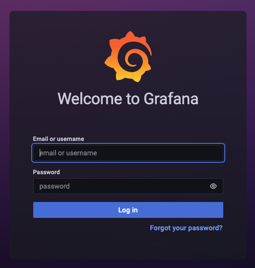

# Setup Grafana using Amazon Managed Grafana

We recommend to get started with Amazon Managed Grafana which is a fully managed service that makes it easy to deploy, operate, and scale Grafana.

## Create an Amazon Managed Grafana workspace

Follow the documentation to create a workspace in the console: https://docs.aws.amazon.com/grafana/latest/userguide/getting-started-with-AMG.html

For a quick start:

- Set the authentication access to `AWS Single Sign-On` (AWS SSO).
- Set the permission type to `Service Managed`. This will trigger an IAM role to be created for you that is used to authenticate your Grafana datasources.

IoT TwinMaker will not be listed as a datasource in the Console, but it will already be installed on your Grafana environment.

See you have the following workspace summary when it is created:



## Configure users

Follow the instructions on the console to configure SSO users for your Amazon Managed Grafana workspace. Assign a user for yourself and make it an `Admin` user type.

The "Grafana workspace URL" is the URL of your Grafana environment. Navigate to that endpoint and login using your SSO credentials.

Skip to the the [datasource setup section](#configure-the-aws-iot-twinmaker-datasource) below.

# Quick start: Setup local Grafana

We will walk through the setup of Grafana in a dev environment running in a Docker container on the developer's local desktop. Once Grafana is running, the configuration for running on a local container vs a cloud instance are similar.

## Create a Docker Container for your Workspace

For the CookieFactory sample this can be achieved by running the setup_local_grafana_docker.sh script from the [src/modules/grafana](../src/modules/grafana) directory. This will create a local container with a recent Grafana image that has the required AWS IoT TwinMaker extensions added to it.

### Cloud9

```bash
sh $GETTING_STARTED_DIR/src/modules/grafana/setup_cloud9_grafana_docker.sh
```

### Local

```bash
sh $GETTING_STARTED_DIR/src/modules/grafana/setup_local_grafana_docker.sh
```

## Browse to your Grafana instance

### Cloud9

If you are running in Cloud9 you can see your Grafana instance by opening your instance's public hostname in your browser. You can run the following from the bash terminal in Cloud9 to print out your instance's public hostname

```
TOKEN=`curl -s -X PUT "http://169.254.169.254/latest/api/token" -H "X-aws-ec2-metadata-token-ttl-seconds: 21600"` && EC2_HOSTNAME=$(curl -H "X-aws-ec2-metadata-token: $TOKEN" -s http://169.254.169.254/latest/meta-data/public-hostname) && echo "http://${EC2_HOSTNAME}"
```

If the page is taking a long time to load, it may be that the Ingress rules for your EC2 instance are not matching the IP address from EC2. To debug, you can try temporarily changing the Ingress rule for HTTP in your security group to "Anywhere-IPv4"

### Local

If you ran the `setup_local_grafana_docker.sh` script from above you can see your Grafana instance at http://localhost:3000.

## Login to Grafana

Once you load the grafana page, you can then logon as Administrator (default username: `admin` password: `admin`). You will be asked to change the default password on first run.



# Configure the AWS IoT TwinMaker Datasource

The next step is to configure Grafana to be able to connect to your IoT TwinMaker Workspace through a data source plugin.

1. From the Grafana home page, select the configuration (gear icon) on the left nav bar and then select 'Data sources'.
2. Select the 'Add data source' button and pick the 'AWS IoT TwinMaker Datasource'.
3. You can then configure the plugin by filling in your credential settings and select your workspace.
4. Choose the `Authentication Provider` based on the environment you have set up.

- Amazon Managed Grafana: `Workspace IAM Role`
- Local setup: `AWS SDK Default`

5. Specify the ARN of the dashboard role you created on step 3 of [deploying an IoT TwinMaker workspace](../README.md#deploying-the-sample-cookie-factory-workspace).

- NOTICE: You must use an AssumeRole ARN when running Grafana in a Cloud9 EC2 instance. This avoids using the EC2 container credentials on the browser when interacting with your IoT TwinMaker dashboards.

6. Click the "Save and Test" button to verify your data source has been configured correctly.

Local docker setup note: the docker setup creates a mapping to your `~/.aws/credentials` file so by using `Authentication Provider: "AWS SDK Default" or "Credentials file"` you can use profiles configured in your environment (or default profile if nothing specified). If running in Cloud9, you can use `AWS SDK Default`.

(Optional) Endpoints for AWS IoT TwinMaker:

Note: if no endpoint is provided, it will default to the `us-east-1` endpoint

- us-east-1: https://iottwinmaker.us-east-1.amazonaws.com

Amazon Managed Grafana example configuration:


Local environment example configuration:


---

## Troubleshooting

### AWS IoT TwinMaker Datasource does not appear in list

If it does not show up in your list you may need to refresh the page a few times.

### User: arn:aws:sts::[accountId]:assumed-role/iottwinmaker_development_role/[instance_id] is not authorized to perform: sts:AssumeRole on resource: ...Dashboard IAM role...

You will need to edit your Dashboard IAM role to grant permissions to grant assume role permissions to the instance. Go to the trust relationships of the IAM role and add the authentication provider ARN:

- Amazon Managed Grafana: workspace IAM role ARN
- Local setup: your IAM user/role ARN

### could not create "var/lib/grafana/plugins/grafana-iot-twinmaker-app", permission denied

If this occurs while running `setup_local_grafana_docker.sh`, try running the following to grant permissions to the grafana configuration directory then rerunning the `setup_local_grafana_docker.sh` command.

```
SCRIPT_DIR=${HOME} && mkdir -p ${SCRIPT_DIR}/local_grafana_data/plugins && sudo chmod 777 ${SCRIPT_DIR}/local_grafana_data && chmod 777 ${SCRIPT_DIR}/local_grafana_data/plugins
```

---

## License

This project is licensed under the Apache-2.0 License.
