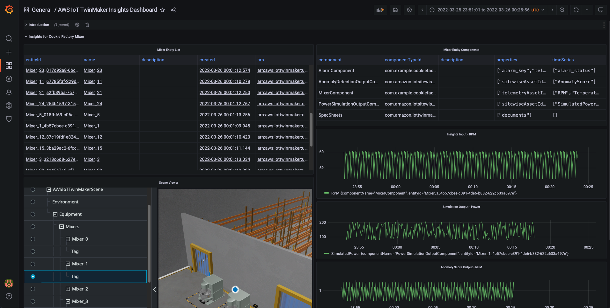

# AWS IoT TwinMaker Insights

## Summary

The module provides a sample integration with simulation functionality via Maplesoft, as well as a sample integration with a pre-trained machine learning model for anomaly detection (using the sample data in the Cookie Factory). 

It deploys the following 2 stacks:

* CookieFactorySageMakerStack - Deploys two SageMaker endpoints, one as a sample simulation service for running MapleSoft simulation, the other as an inference endpoint using a pre-trained anomaly detection model. Both endpoints accept HTTP POST requests. See a sample request in the "Test SageMaker Endpoints" section below. 
* CookieFactoryKdaStack - Contains a KDA Studio notebook application configured with the AWS IoT TwinMaker Flink library. In this notebook you can write Flink SQL streaming applications against AWS IoT TwinMaker data sources. The notebook application also interacts with the simulation/anomaly detection features hosted in SageMaker.

**Note**
* For the general guide on AWS IoT TwinMaker Flink library, see [IoT TwinMaker Flink Library Guide](./iot-twinmaker-flink-library-guide.md).
* Please be aware that this add-on will create running Amazon Kinesis Data Analytics (KDA) compute resources that may incur AWS charges. We recommend stopping or deleting the KDA notebook resources with the steps in [Add-on Teardown: AWS IoT TwinMaker Insights and Simulation](../../../README.md#add-on-teardown-aws-iot-twinmaker-insights-and-simulation) once you are finished using them.

## Prerequisites

* (optional) Install [awscurl](https://github.com/okigan/awscurl) to test simulation service or ML inference directly.
* (optional) Install [jq](https://stedolan.github.io/jq/) for easier environment variable configuration steps when testing simulation services.

---

## Setup / Test

1. Set environment variables for convenience.
  - Change to the directory of this README
    ```
    cd [where this README is]
    ```
  - Set directory for later instructions.
    ```
    export INSIGHT_DIR=$PWD
    ```
  - Set stack names
    ```
    export KDA_STACK_NAME=CookieFactoryKdaStack
    export SAGEMAKER_STACK_NAME=CookieFactorySageMakerStack
    ```  
2. Deploy Insights-related stacks.
  - Change directory.
    ```
    cd $INSIGHT_DIR/cdk
    ```
  - Install cdk dependencies.
    ```
    npm install
    ```
  - Deploy stacks using cdk. Can take a few minutes to setup the SageMaker Endpoint. (Remove `--require-approval never` if you would like to review and accept IAM changes before deploying)
    ```
    cdk deploy --all --require-approval never
    ```
  - Note the SageMaker Endpoint Names that the cdk command will output once finished (output called `SageMakerEndpointNames`). The value will look similar to these: `SimulationEndpoint-IkxImigGVK6i` for simulation, and `AnomalyDetectionEndpoint-ZS4j48mRF3zR` for anomaly detection.
3. (Optional) Test SageMaker Endpoints.
  - Test Simulation Service.
    - Set environment variables for convenience.
      ```
      export SAGEMAKER_STACK_OUTPUTS=$(aws cloudformation describe-stacks --stack-name $SAGEMAKER_STACK_NAME | jq '.Stacks[0].Outputs')
      export SIMULATION_ENDPOINT_NAME=$(echo $SAGEMAKER_STACK_OUTPUTS | jq -r '.[] | select(.OutputKey=="SimulationEndpointName").OutputValue')
      export ENDPOINT_URL=https://runtime.sagemaker.${AWS_DEFAULT_REGION}.amazonaws.com/endpoints/${SIMULATION_ENDPOINT_NAME}/invocations
      ```
    - Send test request against Maplesoft simulation running in SageMaker.
      ```
      awscurl --service sagemaker -X POST -H "Content-Type: application/json" -d '{           
        "inputs": {
          "RPM": 50
        },
        "end_time": 1633396537
      }' $ENDPOINT_URL
      ```
      The response should look something like the following: ```{"end_time": 163339673, "outputs": {"Power": 78.31207971087645}}```.

  - Test Anomaly Detection.
    - Set environment variables for convenience.
      ```
      export AD_ENDPOINT_NAME=$(echo $SAGEMAKER_STACK_OUTPUTS | jq -r '.[] | select(.OutputKey=="AnomalyDetectionEndpointName").OutputValue')
      export AD_ENDPOINT_URL=https://runtime.sagemaker.${AWS_DEFAULT_REGION}.amazonaws.com/endpoints/${AD_ENDPOINT_NAME}/invocations
      ```
    - Send test request against Maplesoft simulation running in SageMaker.
      ```
      awscurl --service sagemaker -X POST -H "Content-Type: application/json" -d '{"instances": [{"features": [58.00]}]}' $AD_ENDPOINT_URL
      ```
      The response should look something like the following: ```{"scores":[{"score":1.019143498}]}```.    
4. Set up KDA Studio, SiteWise resources for insights
  - Start and bootstrap KDA notebook. (Setting up assets for all Mixers can take ~7 minutes and Zeppelin Notebook startup can take ~5 minutes.)

    ```
    cd $INSIGHT_DIR
    ```

    Note: by default, the insights module updates all mixers in the cookie factory with simulation and anomaly detection components, and run Flink jobs for all mixers. If you only want to run analysis for a single mixer, add `--analyze-one-mixer` to the command below.

    ```
    python3 $INSIGHT_DIR/install_insights_module.py --workspace-id $WORKSPACE_ID --region-name $AWS_DEFAULT_REGION --kda-stack-name $KDA_STACK_NAME --sagemaker-stack-name $SAGEMAKER_STACK_NAME --import-all
    ```

  - Navigate to the link output by the preceding command. (This may contain a long pre-signed url token). Please copy the full length of link output.

5. Run Power Simulation Notebook
  - Open the MaplesoftSimulation_all_mixers notebook on the "Welcome to Zeppelin!" page from the previous step.
  - Execute all the paragraphs sequentially in the notebook to see data streamed from AWS IoT TwinMaker into the Maplesoft simulation to produce power consumption results from RPM.

6. Run Anomaly Detection Notebook
  - Open the MaplesoftSimulation_all_mixers notebook on the "Welcome to Zeppelin!" page from the previous step.
  - Execute all the paragraphs sequentially in the notebook to see data streamed from AWS IoT TwinMaker into the Anomaly Detection machine learning model to calculate RPM anomaly scores.

7. (Optional) Promote KDA notebook to KDA app
  - Once you're satisfied with the results in the notebook. You can promote it as a **KDA app with durable state** with following steps.
  - Select paragrah `Query Input` and disable run (Ctrl+ Option+R). Do the same thing for paragraph `Query Output`.
  - Click the dropdown on the right top corner of each note in your notebook with the name of the notebook.
  - Choose **Build [note name] and export to Amazon S3**. (You may need to truncate the application name when you see "Application names can only contain uppercase and lowercase letters, numbers, underscores, hyphens, and periods.").
  - Once the build is complete, use the dropdown and choose **Deploy [note name] as Kinesis streaming application**. Review the application name and choose **Deploy via AWS Console**.
  - This will lead you to the AWS Management Console page for creating a Kinesis Data Analytics application. Use the default setting for now and choose **Create application**.
  - You can choose **Configure** and modify any settings, and choose **Run** to start your streaming application.
  - You can check KDA documentation [Deploying as an application with durable state](https://docs.aws.amazon.com/kinesisanalytics/latest/java/how-notebook-durable.html) and [its tutorial](https://docs.aws.amazon.com/kinesisanalytics/latest/java/example-notebook-deploy.html#example-notebook-deploy-console) for more information.

## Set up AWS IoT TwinMaker Insight Dashboard


This section will be similar to setting up the main Cookie Factory dashboard described in [GettingStarted/README.md](../../../README.md). If you have already finished setting up the main Cookie Factory dashboard. You can skip step 1 below.
1. AWS IoT TwinMaker provides a Grafana plugin that allows you to build dashboards using IoT TwinMaker scenes and modeled data sources. Grafana is deployable as a docker container. We recommend that new users follow these instructions to set up Grafana as a local container: [Instructions](../../../docs/grafana_local_docker_setup.md) (If this link doesn't work in Cloud9, open `docs/grafana_local_docker_setup.md`.)
    For advanced users aiming to set up a production Grafana installation in their account, we recommend checking out https://github.com/aws-samples/aws-cdk-grafana.
2. Import Grafana dashboards for the Cookie Factory.

    Once you have the Grafana page open, you can click through the following to import the following sample dashboard json files in `$INSIGHT_DIR/sample_data/sample_dashboards`.

    * aws_iot_twinmaker_insights_dashboard.json
  
## Adding User-Defined Functions (UDF)
You can register your own User-Defined Functions (UDF) for other type of service integrations in the KDA notebook (for more information on Flink UDF, see https://nightlies.apache.org/flink/flink-docs-release-1.13/docs/dev/table/functions/udfs/). 

The following code snippet is an example of how to write Simulation Function, which is used in this demo. It takes RPM as an input at an timestamp and output the simulated instantaneous power (in Watts) consumed by the machine.
```
import org.apache.flink.util.FlinkRuntimeException；
import com.amazonaws.services.sagemakerruntime.AmazonSageMakerRuntime;
import com.amazonaws.services.sagemakerruntime.AmazonSageMakerRuntimeClient;
import com.amazonaws.services.sagemakerruntime.model.InvokeEndpointRequest;
import com.amazonaws.services.sagemakerruntime.model.InvokeEndpointResult;
import lombok.extern.log4j.Log4j2;
import org.apache.flink.table.functions.FunctionContext;
import org.apache.flink.table.functions.ScalarFunction;
import org.json.JSONObject;

import java.nio.ByteBuffer;
import java.nio.charset.StandardCharsets;
import java.util.HashMap;
import java.util.Map;

@Log4j2
public class SageMakerMixerSimulationFunction extends ScalarFunction {
    private static final String REGION_KEY = "aws.region";
    private static final String ENDPOINT_NAME_KEY = "sagemaker.endpoint.name";
    private static final String CONTENT_TYPE_KEY = "sagemaker.endpoint.contentType";
    private static final String DEFAULT_CONTENT_TYPE = "application/json";
    private static final String POWER_KEY = "Power";
    private static final String DEFAULT_VALUE = "default";

    private static final String SAGEMAKER_REQUEST_FORMAT = "{\"inputs\": {\"RPM\": %f}, \"end_time\": %d}";

    private String endpointName;
    private String contentType;
    private AmazonSageMakerRuntime sageMakerClient;

    @Override
    public void open(FunctionContext context) {
        // access Flink global configuration
        String region = context.getJobParameter(REGION_KEY, DEFAULT_VALUE);
        endpointName = context.getJobParameter(ENDPOINT_NAME_KEY, DEFAULT_VALUE);
        if (DEFAULT_VALUE.equals(region) || DEFAULT_VALUE.equals(endpointName)) {
            String errorMsg = String.format("%s and %s must be provided to run the simulation UDF", REGION_KEY, ENDPOINT_NAME_KEY);
            log.error(errorMsg);
            throw new FlinkRuntimeException(errorMsg);
        }
        contentType = context.getJobParameter(CONTENT_TYPE_KEY, DEFAULT_CONTENT_TYPE);
        sageMakerClient = AmazonSageMakerRuntimeClient.builder()
                .withRegion(region)
                .build();
    }


    /**
     *
     * @param time record timestamp
     * @param rpm mixer RPM
     * @rsrividh Map of "Power" key, and the simulated power value. Defaults to 0 when exception happens
     */
    public Map<String, Double> eval(Integer time, Double rpm) {
        final String requestBody = String.format(SAGEMAKER_REQUEST_FORMAT, rpm.floatValue(), time);

        final InvokeEndpointRequest invokeEndpointRequest = new InvokeEndpointRequest()
                .withAccept(contentType)
                .withContentType(contentType)
                .withEndpointName(endpointName)
                .withBody(ByteBuffer.wrap(requestBody.getBytes(StandardCharsets.UTF_8)));
        Map<String, Double> result = new HashMap<>();
        result.put(POWER_KEY, 0.0);
        try {
            final InvokeEndpointResult invokeEndpointResponse = sageMakerClient.invokeEndpoint(invokeEndpointRequest);

            String output = StandardCharsets.UTF_8.decode(invokeEndpointResponse.getBody()).toString();
            JSONObject jsonObject = new JSONObject(output);

            result.put(POWER_KEY, jsonObject.getJSONObject("outputs").getDouble(POWER_KEY));
            log.info(String.format("Get simulated power result from SageMaker, time: %d, rpm: %f, power: %f.", time, rpm, result.get(POWER_KEY)));
        } catch (final Exception e) {
            log.warn("Got simulation exception, using 0 as the simulated value, continue the application", e);
        }
        return result;
    }
}
```  

## Cleanup

Run the following to remove content installed by the above steps. Note: The stacks may take several minutes to delete.

Delete installed assets

```
python3 $INSIGHT_DIR/install_insights_module.py --workspace-id $WORKSPACE_ID --region-name $AWS_DEFAULT_REGION --kda-stack-name $KDA_STACK_NAME --sagemaker-stack-name $SAGEMAKER_STACK_NAME --delete-all
```

Delete cloudformation stacks

```
aws cloudformation delete-stack --stack-name $KDA_STACK_NAME --region $AWS_DEFAULT_REGION && aws cloudformation wait stack-delete-complete --stack-name $KDA_STACK_NAME --region $AWS_DEFAULT_REGION
```

```
aws cloudformation delete-stack --stack-name $SAGEMAKER_STACK_NAME --region $AWS_DEFAULT_REGION && aws cloudformation wait stack-delete-complete --stack-name $SAGEMAKER_STACK_NAME --region $AWS_DEFAULT_REGION
```
---
## Troubleshooting

#### Zeppelin notebook or Grafana dashboard don't show the input data (RPM)

* In Grafana dashboard, please make sure mixer telemetry data is in the applied time range. The start time of the telemetry data is the `source.initpos.timestamp` value in KDA notebook.

* If the time range is correct, check if the RPM data is returned by using the `get-property-value-history` API (update the startDateTime and endDateTime).
```
aws iottwinmaker get-property-value-history \
   --region $AWS_DEFAULT_REGION \
   --cli-input-json '{"componentName": "MixerComponent","endDateTime": "2022-11-01T00:00:00","entityId": "Mixer_0_cd81d9fd-3f74-437a-802b-9747ff240837","orderByTime": "ASCENDING","selectedProperties": ["RPM"],"startDateTime": "2021-11-01T00:00:00","workspaceId": "'${WORKSPACE_ID}'"}'
```

#### Zeppelin notebook or Grafana dashboard don't show the output data (simulated power/anomaly score)

* Make sure the SageMaker endpoint is working (step 3 in the Setup / Test section above)
* AWS IoT SiteWise accepts values that have a timestamp of no more than 7 days in the past and no more than 10 minutes in the future (
  [SiteWise BatchPutAssetPropertyValue API reference](https://docs.aws.amazon.com/iot-sitewise/latest/APIReference/API_BatchPutAssetPropertyValue.html)). Please make sure the telemetry data for the mixer is within the valid range.

#### "NoResourceAvailableException: Could not acquire the minimum required resources" in KDA Studio notebook

This means KDA doesn't have free resource to run the notebook. Please consider stop the execution for some paragraphs, or change the scaling parameter of the KDA app (refer to the Scaling section in the Configuration tab in the app).

#### Other KDA Studio notebook issues

Please refer to [KDA Studio notebook Troubleshooting page](https://docs.aws.amazon.com/kinesisanalytics/latest/java/how-zeppelin-troubleshooting.html).

---

## License

This project is licensed under the Apache-2.0 License.