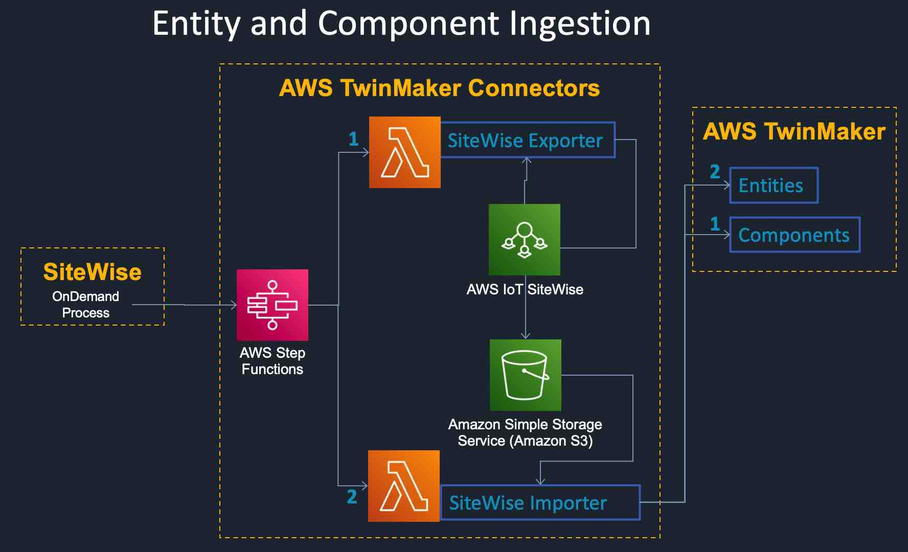

# Migrating SiteWise Models and Assets to IoT TwinMaker Components and Entities
## Summary
The sitewise module allows your to export sitewise assets and models to a JSON file that is stored in S3. This json file can then be imported into IoT TwinMaker such that the exported sitewise models are imported as IoT TwinMaker components and sitewise assets are exported as IoT TwinMaker entities. The sitewise hierarchy is also assigned to IoT TwinMaker entity hierarchy. This migration can be achieved either manually executing the export and import scripts or by executing the step function that is created when you deploy this module as CDK



## Prerequisite
Checkout the latest code from https://github.com/aws-samples/aws-iot-twinmaker-samples. Lets call this directory as IoTTwinMakerHome

## Execute as stand-alone script
```
export AWS_ENDPOINT=<Specific AWS endpoint> ## OR beta or prod or whichever environment
export IoTTwinMakerHome=<Directory where your checked out the code>
export PYTHONPATH=.:${IoTTwinMakerHome}/getting_started/src/modules/sitewise/sync-connector-lambda:${IoTTwinMakerHome}/getting_started/src/libs/connector_utils/python/:$PYTHONPATH # where IoTTwinMakerHome is the directory where you checked out the code.
```

### To export the sitewise models and assets from iot sitewise to S3
```
cd ${IoTTwinMakerHome}/getting_started/src/modules/sitewise/sync-connector-lambda
python migration.py
-b  --bucket                  The bucket to exported sitewise artifacts to.
-p  --prefix                  The prefix under which assets and models will be exported to.
-w  --workspace-id            Workspace id that will be created.
-r  --iottwinmaker-role-arn   ARN of the role assumed by Iottwinmaker
-n  --entity-name-prefix      Prefix to namespace entities
```

## Execute as step function
### Deploy the module using CDK
Checkout the latest code from https://github.com/aws-samples/aws-iot-twinmaker-samples.
Deploy with cdk from the sitewise module directory as shown below:
```
cd cdk && cdk synth && cdk bootstrap aws://unknown-account/us-east-1 && cdk deploy
```
Execute the step function with the following input

```
{
    "bucket": "my-tmp-east",
    "entity_prefix": "my-namespace-",
    "prefix": "sitewise/exports",
    "workspace_id": "sitewise",
    "iottwinmaker_role_arn": "arn:aws:iam::00000000000:role/iot-tm-service-role"
}
```

where
```
    bucket                  The bucket containing exported sitewise models
    entity_prefix           Prefix to namespace entities
    prefix                  The prefix to store exported sitewise assets and models
    workspace_id            Workspace id that will be created
    iottwinmaker_role_arn   IAM role that has permissions to create a workspace
```

---

## License

This project is licensed under the Apache-2.0 License.
