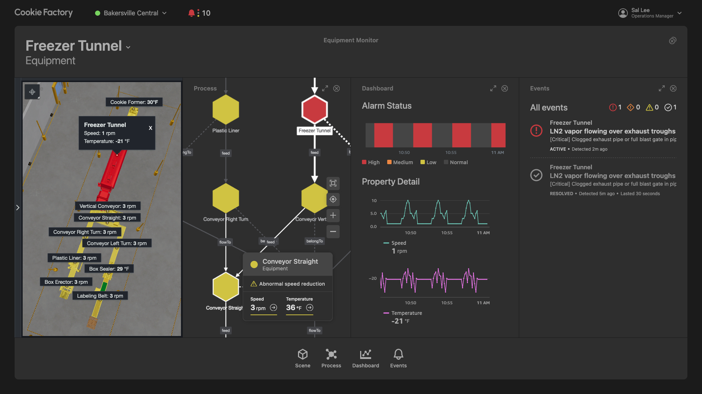

# AWS IoT TwinMaker Getting Started - Bakersville Cookie Factory Digital Twin Monitoring Application

## Summary

This project walks you through the process of setting up the Bakersville Cookie Factory Digital Twin Monitoring Application powered by AWS IoT TwinMaker.



## Prerequisites

Note: These instructions have primarily been tested for OSX/Linux/WSL environments. For a standardized development environment, consider using [AWS Cloud9](https://aws.amazon.com/cloud9) (note you may need to adjust the instance disk size [[1]](https://github.com/aws-samples/aws-iot-twinmaker-samples/tree/main/src/workspaces/cookiefactoryv2#not-enough-disk-space-on-cloud9)).

1. This sample depends on AWS services that might not yet be available in all regions. Please run this sample in one of the following regions:
   - US East (N. Virginia) (us-east-1)
   - US West (Oregon) (us-west-2)
   - Europe (Ireland) (eu-west-1)
2. An AWS account for IoT TwinMaker + [AWS CLI](https://docs.aws.amazon.com/cli/latest/userguide/install-cliv2.html)
   - We recommend that you [configure](https://docs.aws.amazon.com/cli/latest/userguide/cli-chap-configure.html) your default credentials to match the account in which you want to set up this getting started example. Use the following command to verify that you are using the correct account. (This should be pre-configured in Cloud9.)
     ```shell
     aws sts get-caller-identity
     ```
   - Ensure your AWS CLI version is at least 1.22.94. (or 2.5.5+ for AWS CLI v2)
     ```shell
     aws --version
     ```
   - When you are set up, test your access with the following command. (You should not receive errors.)
     ```
      aws iottwinmaker list-workspaces --region us-east-1
     ```
   - Note: your credentials should have permissions to AWS S3, AWS IoT TwinMaker, and AWS CloudFormation to deploy the content to your account.
3. [Node.js](https://nodejs.org/en/) & [NPM](https://docs.npmjs.com/downloading-and-installing-node-js-and-npm) with node v16.x+ and npm version 8.10.0+. (This should be pre-installed in Cloud9.) Use the following commands to verify.

   ```shell
   node --version
   ```

   ```shell
   npm --version
   ```

4. [AWS CDK toolkit](https://docs.aws.amazon.com/cdk/latest/guide/getting_started.html#getting_started_install) with version at least `2.76.0`. (The CDK should be pre-installed in Cloud9, but you may need to bootstrap your account.) Use the following command to verify.

   ```shell
   cdk --version
   ```

   - You will also need to bootstrap your account for CDK so that custom assets, such as sample Lambda functions, can be easily deployed. Use the following command.

     ```shell
     cdk bootstrap aws://[your 12 digit AWS account id]/[region] --app ''

     # example
     # cdk bootstrap aws://123456789012/us-east-1 --app ''
     ```

5. [Docker](https://docs.docker.com/get-docker/) version 20+ installed and running. (This should be pre-installed in Cloud9.) Authenticate Docker for public ECR registries
   ```shell
   docker --version
   ```
   - Use the following command to build Lambda layers for CDK.
     ```shell
     aws ecr-public get-login-password --region us-east-1 | docker login --username AWS --password-stdin public.ecr.aws
     ```

---

## Setup / Test

### Create a TwinMaker workspace (if reusing an existing one, please ensure it is empty)

#### Console instructions

1. Go to https://us-east-1.console.aws.amazon.com/iottwinmaker/home
2. Click "Create Workspace"
3. Enter a workspace name of your choice and note it down (will be supplied to later commands below)
4. Under "S3 bucket", select "Create an S3 bucket"
5. Under "Execution Role", select "Auto-generate a new role"
6. Click "Skip to review and create"
7. Click "Create workspace". Note the name of the created S3 bucket (will be supplied to later commands below)

### Setup application AWS resources (e.g. AWS IoT TwinMaker, Sample Lambdas, Sample Data, etc.)

- Set environment variables for convenience. Note: "WORKSPACE_ID" is the same as "Workspace Name" on some console pages. Also, WORKSPACE_BUCKET_NAME is the bucket name for the workspace, not the ARN.
  ```shell
  export WORKSPACE_ID=__FILL_IN__
  export WORKSPACE_BUCKET_NAME=__FILL_IN__
  ```
- Prepare environment (run from the same directory as this README)
  ```shell
  cd cdk && npm install
  ```
- Deploy CDK stack containing application resources.
  ```shell
  cdk deploy \
    --context stackName="CookieFactoryDemo" \
    --context iottwinmakerWorkspaceId="$WORKSPACE_ID" \
    --context iottwinmakerWorkspaceBucket="$WORKSPACE_BUCKET_NAME"
  ```
- Return to root project directory
  ```shell
  cd ..
  ```
- (optional) Verify that the resources have been created (Change `region` as needed. Commands should return results and scene should load in console)
  - Verify data connectivity by invoking [AWS IoT TwinMaker data connectors](https://docs.aws.amazon.com/iot-twinmaker/latest/guide/data-connector-interface.html)
    ```shell
    aws iottwinmaker get-property-value-history \
        --region us-east-1 \
        --cli-input-json '{"componentName": "CookieLineComponent","endTime": "2023-06-01T01:00:00Z","entityId": "PLASTIC_LINER_a77e76bc-53f3-420d-8b2f-76103c810fac","orderByTime": "ASCENDING","selectedProperties": ["alarm_status", "AlarmMessage", "Speed"],"startTime": "2023-06-01T00:00:00Z","workspaceId": "'$WORKSPACE_ID'", "maxResults": 10}'
    ```
  - Verify entity relationships using AWS IoT TwinMaker Knowledge Graph query
    ```shell
    aws iottwinmaker execute-query --cli-input-json '{"workspaceId": "'$WORKSPACE_ID'","queryStatement": "SELECT processStep, r1, e, r2, equipment     FROM EntityGraph     MATCH (cookieLine)<-[:isChildOf]-(processStepParent)<-[:isChildOf]-(processStep)-[r1]-(e)-[r2]-(equipment), equipment.components AS c     WHERE cookieLine.entityName = '"'"'COOKIE_LINE'"'"'     AND processStepParent.entityName = '"'"'PROCESS_STEP'"'"'     AND c.componentTypeId = '"'"'com.example.cookiefactory.equipment'"'"'"}'
    ```
  - Verify scene loads in console (update workspace id `__FILL_IN__`) : `https://us-east-1.console.aws.amazon.com/iottwinmaker/home?region=us-east-1#/workspaces/__FILL_IN__/scenes/CookieFactory`

### Setup AWS IoT TwinMaker Cookie Factory Demo: Web Application

1. Use the following CLI command to administratively set the password for your demo Cognito user. Your UserPoolId can be found after your CDK deploy completed in the CloudFormationOutput (printed to console). Be sure to create a password that meets the default Cognito password requirements (Lowercase letter, Uppercase letter, Number, Symbol, Length >= 8)

```shell
aws cognito-idp admin-set-user-password --user-pool-id "[YOUR_USER_POOL_ID]" --username "user@cookiefactory" --password "[PASSWORD]" --permanent
```

_OPTIONAL_: View the [Amazon Cognito set-up instructions](./COGNITO_SAMPLE_SETUP_CONSOLE.md) to create your own application user account. A sample UserPool, IdentityPool, UserPoolClient, and User was created through CDK.

2. Change to the web application directory.
   ```shell
   cd CookieFactoryDemo
   ```
3. Prepare the environment.

   ```shell
   npm install
   ```

4. Edit the web application configuration files. **Note: the files referenced in the following steps are relative to the `CookieFactoryDemo` directory.**

   a. In `src/config/sites.template.ts`, set `workspaceId` to your AWS IoT TwinMaker workspace ID. Rename the file to `src/config/sites.ts`.

   ```typescript
   const sites: Record<string, SiteConfig[]> = {
     'user@cookiefactory': [
       {
         defaults: {
           panelIds: [],
           viewId: 'panel',
         },
         iottwinmaker: {
           sceneId: 'CookieFactory',
           workspaceId: '__FILL_IN__',
         },
         id: crypto.randomUUID(),
         location: '1 Main Street, Bakersville, NC, USA',
         name: 'Bakersville Central',
       },
     ],
   };
   ```

   b. In `src/config/cognito.template.ts`, set the IDs and region to those specified in the Amazon Cognito user and identity pools created in CDK. You should be able to find all 3 in the CloudFormation output in the terminal you ran cdk deploy. Rename the file to `src/config/cognito.ts`.

   ```typescript
   const cognito: CognitoAuthenticatedFlowConfig = {
     clientId: '__FILL_IN__',
     identityPoolId: '__FILL_IN__',
     region: '__FILL_IN__',
     userPoolId: '__FILL_IN__',
   };
   ```

   c. In `src/config/users.template.ts`, set `password` to the newly created password for the Amazon Cognito user account created in step 1. By default, the email should be set to "user@cookiefactory". Set `firstName`, `lastName`, and `title` to your preference. Rename the file to `src/config/users.ts`.

   ```typescript
   const users: UserConfig[] = [
     {
       email: 'user@cookiefactory',
       firstName: '__FILL_IN__',
       lastName: '__FILL_IN__',
       password: '__FILL_IN__',
       title: '__FILL_IN__',
     },
   ];
   ```

5. Start the development server.

   ```shell
   npm run dev
   ```

6. Navigate to `https://localhost:8080` to view the application, which may take a minute to load the first time.
   - **Note: set the localhost port to your preference in `webpack.dev.js`. Defaults to `8080`.**

## Cleanup

Navigate back to cdk folder for the following steps

```shell
cd ../cdk
```

1. Delete resources using CDK (note: can also be done in AWS Console / CLI against the CloudFormation stack)
   - cdk destroy
     ```
     cdk destroy \
       --context stackName="CookieFactoryDemo" \
       --context iottwinmakerWorkspaceId="$WORKSPACE_ID" \
       --context iottwinmakerWorkspaceBucket="$WORKSPACE_BUCKET_NAME"
     ```
2. Delete Remaining TwinMaker Resources
   ### Option 1: Console Instructions
   #### TwinMaker Workspace
   1. Go to https://us-east-1.console.aws.amazon.com/iottwinmaker/home
   2. On left side panel, click "Workspaces"
   3. Select (click the circle) on the workspace you created earlier, $WORKSPACE_ID
   4. Click "Delete"
   5. In pop-up field, confirm deletion by typing in "Delete"
   #### S3 Buckets
   1. Go to https://us-east-1.console.aws.amazon.com/s3/home
   2. Under "buckets" search for your TwinMaker workspace bucket (there may also be a logging bucket which you can delete too)
   3. Select bucket(s) and click "Delete". You will be prompted to enter the bucket name to confirm.
   ### Option 2: [TMDT Destroy](https://www.npmjs.com/package/@iot-app-kit/tools-iottwinmaker)
   1. Install TwinMaker Development Tools
      ```shell
      npm i -g @iot-app-kit/tools-iottwinmaker
      ```
   2. Call TMDT destroy with delete-workspace and delete-s3-bucket flags set
      ```shell
      tmdt destroy --workspace-id [Workspace_ID] --region us-east-1 --delete-workspace --delete-s3-bucket --nonDryRun
      ```
   3. _Optional_: uninstall TMDT
      ```shell
      npm uninstall -g @iot-app-kit/tools-iottwinmaker
      ```

## Troubleshooting

For any issue not addressed here, please open an issue or contact AWS Support.

### Web application landing page loads but after clicking on a user the page just refreshes

- Try opening your browser's web development tools to see if there are any errors in the console logs
- Typically the page not loading further is due to configuration mismatches (e.g. in `cognito.ts`, `sites.ts`, or `users.ts`) or the Cognito user did not have its password administratively reset with `admin-set-user-password` (see details in [Amazon Cognito set-up instructions](./COGNITO_SAMPLE_SETUP_CONSOLE.md))

### Not enough disk space on Cloud9

- Some useful commands for resizing disk on Cloud9
  ```shell
  curl https://aws-data-analytics-workshops.s3.amazonaws.com/athena-workshop/scripts/cloud9\_resize.sh > cloud9\_resize.sh
  sh cloud9\_resize.sh 20
  df -h
  ```

### No space during `cdk deploy: OSError: [Errno 28] No space left on device`

- Consider pruning your unused Docker containers
  ```shell
  docker system prune --all --force
  ```

### `This CDK CLI is not compatible with the CDK library used by your application`

- Upgrade your installation of AWS CDK:
  ```shell
  npm install -g aws-cdk
  ```
- If the above doesn't resolve the issue, try to uninstall first then re-install
  ```shell
  npm uninstall -g aws-cdk && npm install -g aws-cdk
  ```
- If uninstall/re-install doesn't work, verify the path your `cdk` CLI is deployed relative to `npm`.
  ```shell
  which cdk
  which npm
  ```
  - e.g. if using [nvm](https://npm.github.io/installation-setup-docs/installing/using-a-node-version-manager.html) they should both be in the same `... /.nvm/versions/node/<node_version>/bin/` directory

### `... com.docker.docker/Data/backend.sock: connect: no such file or directory`

- Confirm that docker is running: `docker --version`

---

## License

This project is licensed under the Apache-2.0 License.
