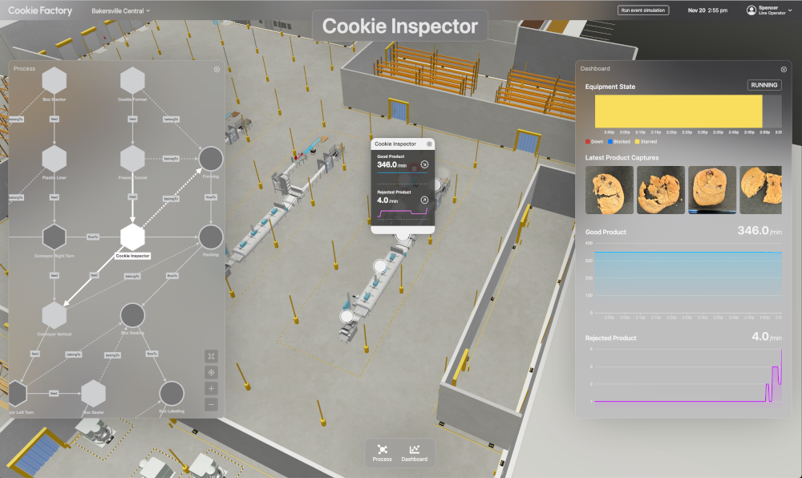

# Note: This project is intended as a non-production sample application to demonstrate an integration between an AWS IoT TwinMaker dashboard and AWS Bedrock and should not be run in production accounts

# AWS IoT TwinMaker Getting Started - Bakersville Cookie Factory Digital Twin and Assistant Monitoring Application

## Summary

This project walks you through the process of setting up the Bakersville Cookie Factory Digital Twin Monitoring Application powered by AWS IoT TwinMaker.



## Prerequisites

Note: These instructions have primarily been tested for OSX/Linux/WSL environments. For a standardized development environment, consider using [AWS Cloud9](https://aws.amazon.com/cloud9) (note you may need to adjust the instance disk size [[1]](https://github.com/aws-samples/aws-iot-twinmaker-samples/tree/main/src/workspaces/cookiefactoryv3#not-enough-disk-space-on-cloud9)).

1. This sample depends on AWS services that might not yet be available in all regions. Please run this sample in one of the following regions:
   - US East (N. Virginia) (us-east-1)
   - US West (Oregon) (us-west-2)
   - Europe (Frankfurt) (eu-central-1)
2. An AWS account for AWS IoT TwinMaker + [AWS CLI](https://docs.aws.amazon.com/cli/latest/userguide/install-cliv2.html)
   - We recommend that you [configure](https://docs.aws.amazon.com/cli/latest/userguide/cli-chap-configure.html) your default credentials to match the account in which you want to set up this getting started example. Use the following command to verify that you are using the correct account. (This should be pre-configured in Cloud9.)
     ```shell
     aws sts get-caller-identity
     ```
   - Ensure your AWS CLI version is at least 1.22.94. (or 2.5.5+ for AWS CLI v2)
     ```shell
     aws --version
     ```
   - When you are set up, test your access with the following command. (You should not receive errors.)
     ```
      aws iottwinmaker list-workspaces --region us-east-1
     ```
   - Note: your credentials should have permissions to AWS S3, AWS IoT TwinMaker, AWS CloudFormation, and AWS Bedrock to deploy and run the content in your account.
3. [Node.js](https://nodejs.org/en/) & [NPM](https://docs.npmjs.com/downloading-and-installing-node-js-and-npm) with node v16.x+ and npm version 8.10.0+. (This should be pre-installed in Cloud9.) Use the following commands to verify.

   ```shell
   node --version
   ```

   ```shell
   npm --version
   ```

4. [AWS CDK toolkit](https://docs.aws.amazon.com/cdk/latest/guide/getting_started.html#getting_started_install) with version at least `2.76.0`. (The CDK should be pre-installed in Cloud9, but you may need to bootstrap your account.) Use the following command to verify.

   ```shell
   cdk --version
   ```

   - You will also need to bootstrap your account for CDK so that custom assets, such as sample Lambda functions, can be easily deployed. Use the following command.

     ```shell
     cdk bootstrap aws://[your 12 digit AWS account id]/[region] --app ''

     # example
     # cdk bootstrap aws://123456789012/us-east-1 --app ''
     ```

5. [Docker](https://docs.docker.com/get-docker/) version 20+ installed and running. (This should be pre-installed in Cloud9.) Authenticate Docker for public ECR registries
   ```shell
   docker --version
   ```
   - Use the following command to build Lambda layers for CDK.
     ```shell
     aws ecr-public get-login-password --region us-east-1 | docker login --username AWS --password-stdin public.ecr.aws
     ```

6. [python](https://www.python.org/downloads/) version >=3.8.1, <3.12
   ```shell
   python3 --version
   ```

6. [jq](https://jqlang.github.io/jq/download/) version 1.6+
   ```shell
   jq --version
   ```

---

## Setup / Test

### Set environment variables

- Set environment variables for convenience. The AWS IoT TwinMaker workspace will be created in the following scripts.
  ```shell
  export AWS_DEFAULT_REGION=__FILL_IN__
  export CDK_DEFAULT_ACCOUNT=__FILL_IN__
  export WORKSPACE_ID=__FILL_IN__
  export CFN_STACK_NAME=__FILL_IN__
  ```

### Setup application AWS resources (e.g. AWS IoT TwinMaker, Sample Lambdas, Sample Data, etc.)

- Prepare environment (run from the same directory as this README)
  ```shell
  cd cdk && ./install.sh
  ```
- Return to root project directory
  ```shell
  cd ..
  ```

### Setup AWS IoT TwinMaker Cookie Factory Demo: Web Application Dashboard

- Prepare environment (run from the same directory as this README)
  ```shell
  cd dashboard && ./install.sh
  ```
- Return to root project directory
  ```shell
  cd ..
  ```

### Start application

- Prepare environment (run from the same directory as this README)
  ```shell
  cd dashboard
  ```

- Start the development server.
  ```shell
  npm run dev
  ```

6. Navigate to `https://localhost:8443` to view the application.

## Cleanup

Navigate back to cdk folder for the following steps

```shell
cd ../cdk && ./uninstall.sh
```

## Troubleshooting

For any issue not addressed here, please open an issue or contact AWS Support.

### Not enough disk space on Cloud9

- Some useful commands for resizing disk on Cloud9
  ```shell
  sh cloud9\_resize.sh 20
  df -h
  ```

### No space during `cdk deploy: OSError: [Errno 28] No space left on device`

- Consider pruning your unused Docker containers
  ```shell
  docker system prune --all --force
  ```

### `This CDK CLI is not compatible with the CDK library used by your application`

- Upgrade your installation of AWS CDK:
  ```shell
  npm install -g aws-cdk
  ```
- If the above doesn't resolve the issue, try to uninstall first then re-install
  ```shell
  npm uninstall -g aws-cdk && npm install -g aws-cdk
  ```
- If uninstall/re-install doesn't work, verify the path your `cdk` CLI is deployed relative to `npm`.
  ```shell
  which cdk
  which npm
  ```
  - e.g. if using [nvm](https://npm.github.io/installation-setup-docs/installing/using-a-node-version-manager.html) they should both be in the same `... /.nvm/versions/node/<node_version>/bin/` directory

### `... com.docker.docker/Data/backend.sock: connect: no such file or directory`

- Confirm that docker is running: `docker --version`

---

## License

This project is licensed under the Apache-2.0 License.
